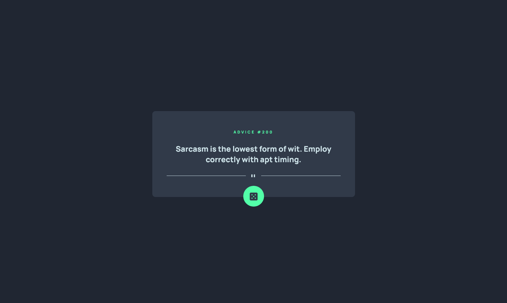
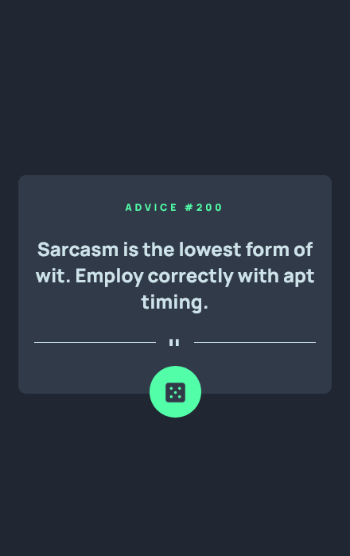

# Frontend Mentor - Advice Generator app solution

This is a solution to the [Advice generator app challenge on Frontend Mentor](https://www.frontendmentor.io/challenges/advice-generator-app-QdUG-13db). Frontend Mentor challenges help you improve your coding skills by building realistic projects.

## Table of contents

- [Overview](#overview)
  - [The challenge](#the-challenge)
  - [Screenshot](#screenshot)
- [My process](#my-process)
  - [Built with](#built-with)
  - [Continued development](#continued-development)
  - [Useful resources](#useful-resources)
- [Author](#author)

## Overview

### The challenge
Advice Generator App

Users should be able to:
- View the optimal layout for the app depending on their device's screen size
- See hover states for all interactive elements on the page
- Generate a new piece of advice by clicking the dice icon

### Screenshot

## My process

### Built with
- Javascript
- Semantic HTML5 markup
- CSS custom properties
- Flexbox

### Continued development

Would like to do bug fixes on Firefox and optimization. 

### Useful resources

- [CSS Glow Generator](https://cssbud.com/css-generator/css-glow-generator/) - Helps facilitate creating cool box shadow effects.

## Author

- Website - [Pauline K](https://kucharew.dev)
- Frontend Mentor - [@pkucharew](https://www.frontendmentor.io/profile/pkucharew)
- Twitter - [@pkucharew](https://www.twitter.com/pkucharew)
